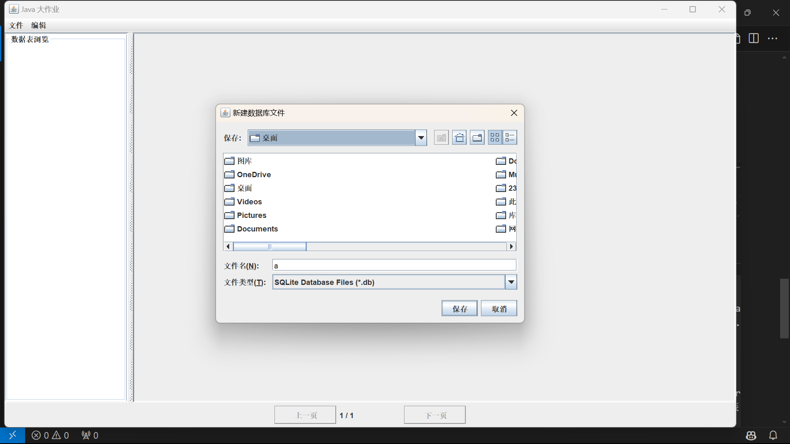
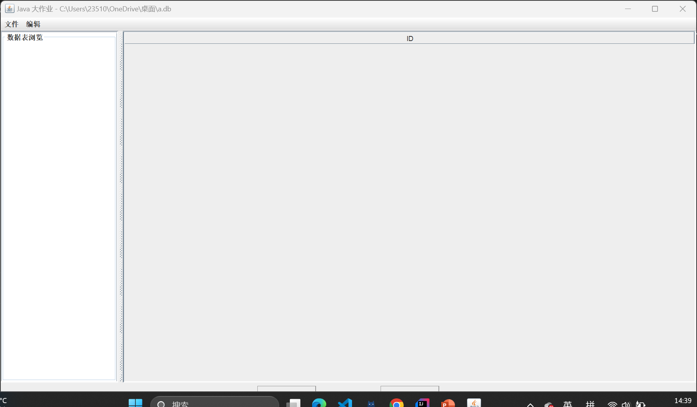
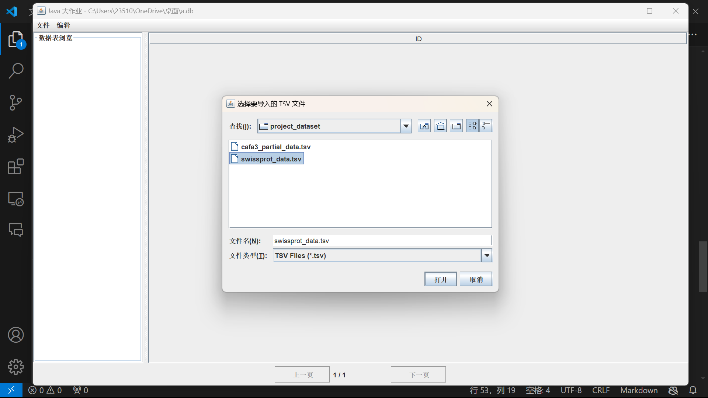
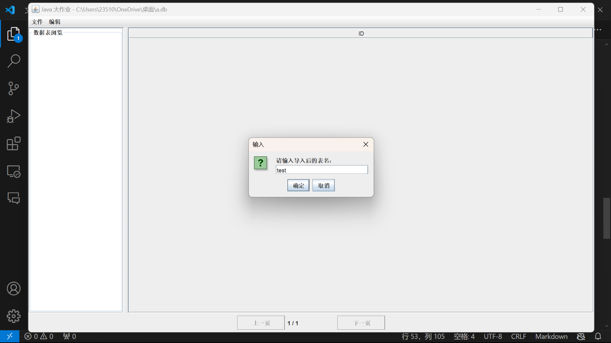
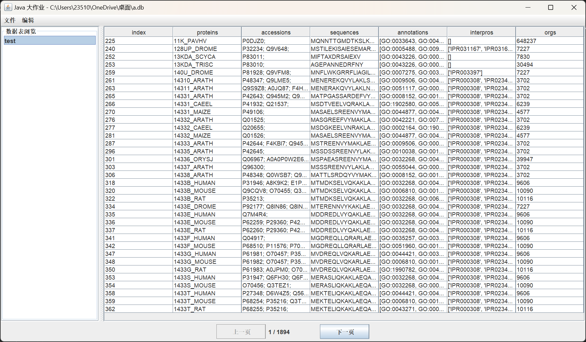
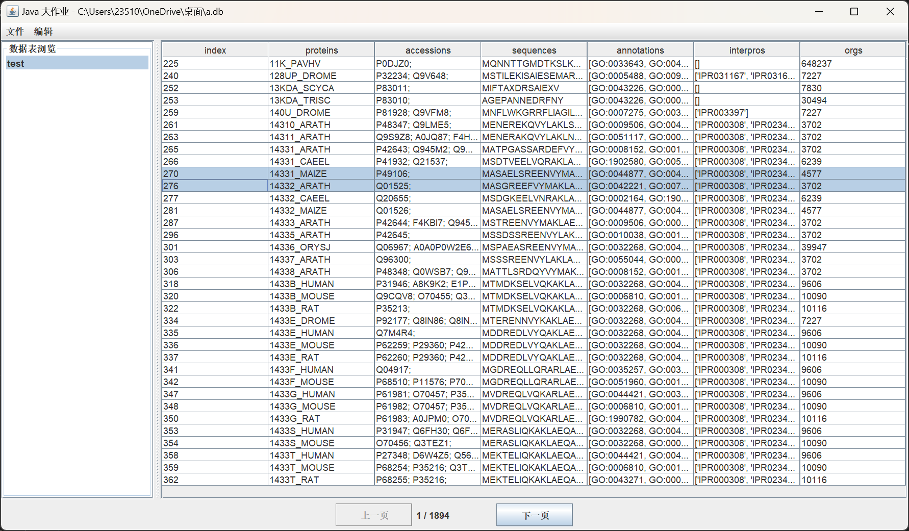
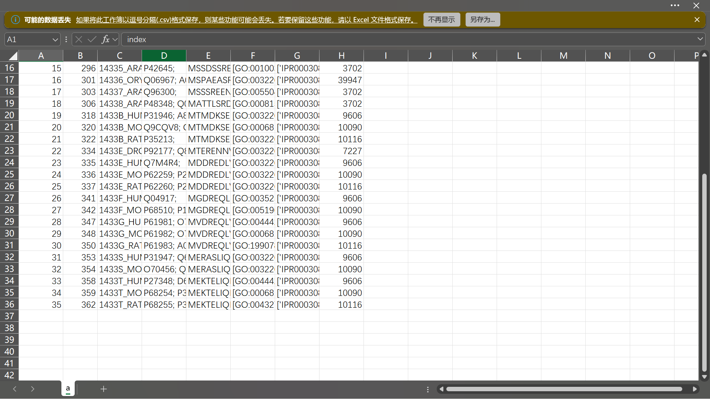
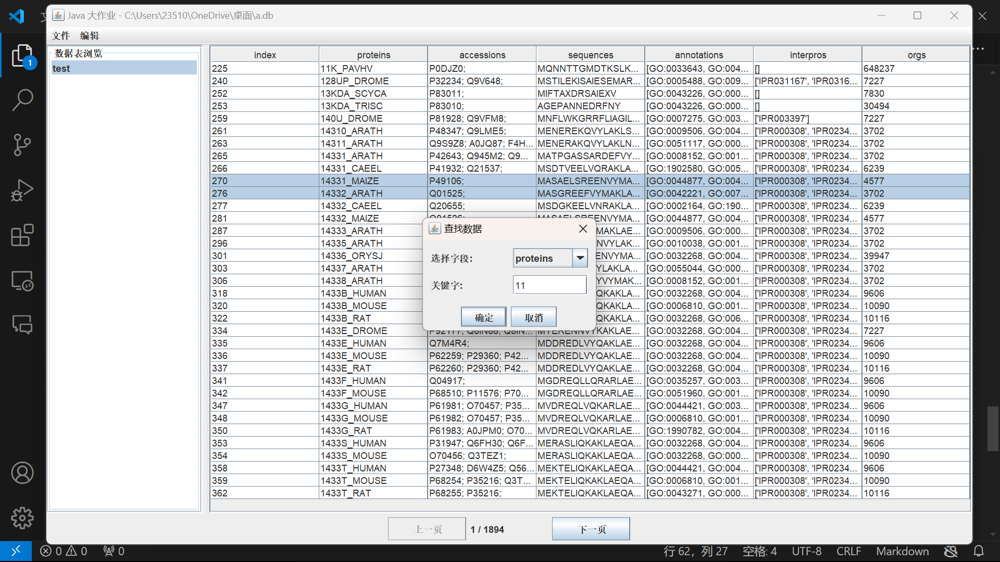
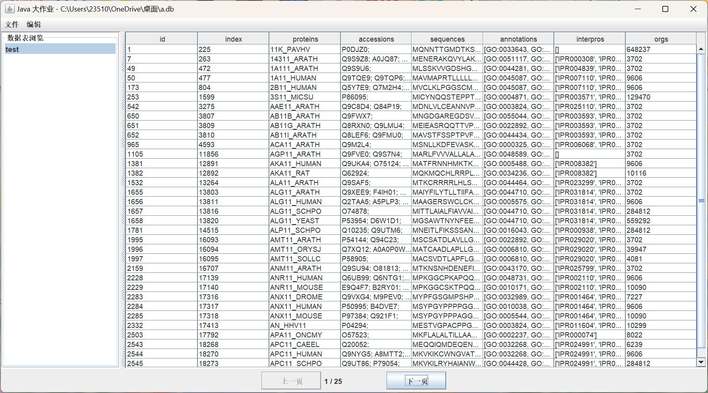
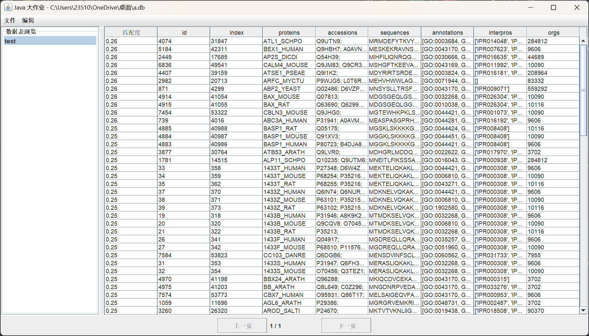

# Java大作业——生信数据管理系统

## 1. 项目简介

基于 SQLite 的生物信息学数据管理系统，支持 TSV 文件导入、数据查询（包含模糊匹配）、数据导出等功能。

### 技术栈

- **JDK**: 22
- **GUI**: Java Swing
- **构建工具**: Maven
- **核心依赖**:

    ```xml
    <dependency>
        <groupId>org.xerial</groupId>
        <artifactId>sqlite-jdbc</artifactId>
        <version>3.43.2.1</version>
    </dependency>
    <dependency>
        <groupId>org.apache.commons</groupId>
        <artifactId>commons-csv</artifactId>
        <version>1.10.0</version>
    </dependency>
    <dependency>
        <groupId>org.apache.commons</groupId>
        <artifactId>commons-text</artifactId>
        <version>1.10.0</version>
    </dependency>
    ```

## 2. 编译指南

### 环境要求

- **JDK** 22
- **Maven**（需能访问中央仓库）

### 编译步骤

1. 使用 IDEA 打开项目。
2. 导航至：`文件` -> `项目结构` -> `工件`。
3. 添加 JAR（来自具有依赖的模块）。
4. 选择主类：`MainView.java`。
5. 点击 `构建` -> `构建工件` 进行编译。
6. 编译后的 JAR 文件位于步骤 2 设置的目录下。

## 3. 运行说明

确保 Java 运行环境正确配置，双击编译生成的 JAR 文件即可运行。

## 4. 功能测试步骤

### 1. 功能列表

- **快捷键**：
    - `Ctrl+C`：复制指定数据
    - `Ctrl+F`：数据查找
- **文件操作**：
    - TSV 文件导入（单个/多个）
    - 数据库创建
    - 用户输入数据插入
    - 选定数据导出
    - 查找结果导出
- **数据分析**：
    - 数据查找
    - 数据删除
    - 高阶查找（相似度，编辑距离）

### 2. 测试流程

1. **创建数据库**：

     - 点击 `文件` -> `新建`，选择数据库位置并设置名称（如 `a.db`）。
         
     - 创建完成后，界面显示如下：
         

2. **数据导入**：

     - 选择 `swissprot_data.csv`，点击 `导入`。
     - 输入数据表名称（如 `test`），点击确定。
     - 导入完成后，界面自动更新：
         
         
     - 点击左侧数据表 `test`，查看数据是否成功导入：
         

3. **复制数据**：

     - 选中部分数据，按 `Ctrl+C` 复制。
         
     - 粘贴结果如下（精简版）：

         ```
         270	14331_MAIZE	P49106;	...	['IPR000308', 'IPR023409', 'IPR023410']	4577
         276	14332_ARATH	Q01525;	...	['IPR000308', 'IPR023409', 'IPR023410']	3702
         ```

4. **导出数据**：

     - 点击 `编辑` -> `导出`，选择 `当前页`，命名为 `a.csv`。
     - 打开导出的文件，确认导出成功：
         

5. **数据查找**：

     - 按 `Ctrl+F` 或点击 `编辑` -> `查找`，输入查找条件：
         
     - 查看查找结果：
         
     - 使用导出功能导出查找结果。

6. **高阶查找**：

     - 点击 `编辑` -> `高阶查找`，对 `sequence` 字段进行高阶查找，输入 `AGE`。
     - 高阶查找将返回相似度信息：
         

## 5. 项目结构

```plaintext
src/
├── main/java/org/example/
        ├── MainView.java              # 程序入口与 UI 实现
        ├── CSVExporter.java           # CSV 导出功能
        ├── DOperator.java             # SQLite 数据库操作封装
        ├── ImportProgressCallback.java# 导入进度回调接口
        ├── SelectResult.java          # 查询结果数据结构
        └── TSVImporter.java           # TSV 文件导入功能
```
## 6.蛋白质计算实现
### 相似度计算方法

为了准确评估蛋白质序列之间的相似性，程序采用了两种相似度计算方法：

- **Levenshtein距离**：也称为编辑距离，衡量将一个序列转换为另一个序列所需的最少编辑操作（插入、删除、替换）的数量。Levenshtein距离越小，序列越相似。
- **Jaro-Winkler距离**：一种更复杂的相似度度量方法，主要用于字符串匹配。它考虑了字符顺序和匹配字符的位置，特别适用于检测拼写错误和名称匹配。Jaro-Winkler距离越接近1，表示序列越相似。

上述计算功能的实现来自于 `org.apache.commons` 的 `commons-text` 包。

### 高阶查找功能

程序的高阶查找功能结合了上述相似度计算方法，通过以下步骤实现对蛋白质序列的相似性分析：

1. **初步筛选**：首先使用标准搜索（基于 `LIKE` 操作符）从数据库中筛选出包含关键字的序列，限制返回结果为前1000条，以提高计算效率。
2. **相似度计算**：对筛选出的序列，分别计算 Levenshtein 距离和 Jaro-Winkler 距离，综合这两种方法的结果得出综合相似度分数。
3. **排序与筛选**：根据综合相似度分数，对序列进行降序排序，选取相似度最高的前100条记录作为最终的高阶搜索结果。